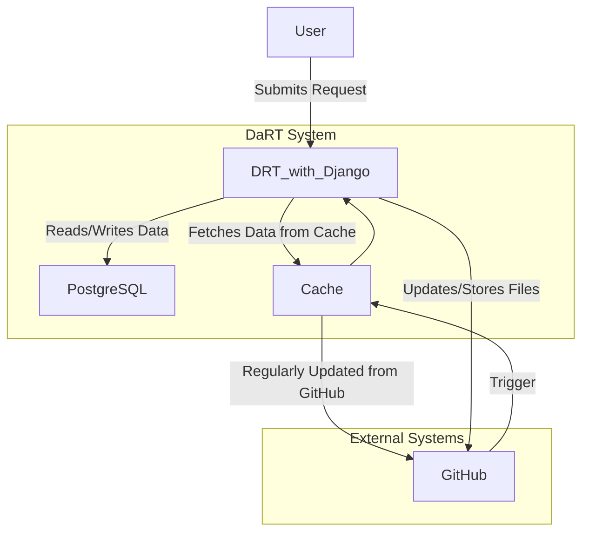

---
### **Explanation of the Diagram with Cache**:

1. **User Interaction**:
   - **User** submits a request through the **Django** web service (e.g., filling out a questionnaire or accessing negotiation data).

2. **Cache Layer**:
   - **Django** first queries the **Cache** (a local data store within the DaRT system) to serve **recently accessed** or **frequently used data** (e.g., questionnaire templates, licenses).
   - This improves performance by reducing the need to fetch data directly from **GitHub** each time.
   
3. **Cache Update from GitHub**:
   - **GitHub** serves as the **central data store** for static files like **questionnaires**, **licenses**, and **metadata**.
   - A **trigger mechanism** is in place: when a file or relevant data in GitHub is modified, GitHub sends an **alert** to DaRT, notifying it to **refresh its cache**.
   - Alternatively, DaRT can periodically check for updates if webhooks aren’t set up in GitHub.

4. **Django to PostgreSQL**:
   - For dynamic data, such as ongoing negotiations, **Django** reads/writes directly to **PostgreSQL**.
   - PostgreSQL handles relational data for **requestors**, **owners**, **negotiations**, and their states.

5. **Django to GitHub**:
   - When documents like **licenses** or **completed questionnaires** are generated, **Django** uploads these to **GitHub** for persistent storage.
   
6. **Django Reads from GitHub and Cache**:
   - When data is requested (e.g., a new questionnaire needs to be loaded), **Django** first checks the **Cache**. If the cache is stale or doesn’t contain the needed data, it fetches the **latest version from GitHub** and updates the cache.
   - This caching system ensures that GitHub is the **source of truth** but minimizes direct requests to GitHub, improving efficiency.

---

### **Entire Workflow of DaRT System with Caching**

1. **User Submits Request**:
   - The requestor accesses DaRT via a **UUID-based link** and submits a **data request** using a questionnaire.
   - **Django** handles the user interaction, pulling necessary data (like questionnaire schemas) from the **Cache** if it is available, or directly from **GitHub** if necessary.

2. **Cache and GitHub Interaction**:
   - **Cache Layer**: DaRT has a local cache where **recent data** (e.g., questionnaires, metadata) is stored for quicker access.
   - **Trigger from GitHub**: Whenever a change happens in GitHub (such as an updated questionnaire or new metadata), a **trigger** or webhook sends an alert to DaRT, prompting it to **refresh its cache**. If triggers aren’t set up, DaRT regularly **polls GitHub** for changes.

3. **Data Fetching from GitHub**:
   - When new data is needed, **Django** checks the **cache** first. If data is not in the cache or is outdated, Django fetches it from **GitHub** and updates the cache.
   - This ensures DaRT always has the latest data while avoiding unnecessary traffic to GitHub.

4. **Handling Negotiations**:
   - **Django** manages **negotiation data** (requestor-owner interactions) by reading/writing negotiation states to **PostgreSQL**.
   - Each negotiation is tracked in **PostgreSQL**, and its related documents (like licenses or query outputs) are stored back into **GitHub** after approval.

5. **Updating GitHub**:
   - Once a negotiation is completed or a license is generated, **Django** saves the final documents (e.g., licenses, responses) into **GitHub** for record-keeping.
   
6. **Serving Data Efficiently**:
   - As DaRT continues to serve requestors and owners, it uses the **cache** to minimize frequent pulls from GitHub while ensuring that cached data is always up-to-date when changes are made in the **GitHub repository**.

---

### **Advantages of this Workflow with Caching**:
1. **Performance**: Caching reduces latency by minimizing direct requests to GitHub, especially for frequently accessed data.
2. **Real-time Updates**: The **trigger mechanism** ensures that any updates in GitHub are reflected in DaRT's cache, keeping the system updated without unnecessary manual intervention.
3. **Scalability**: This design allows DaRT to handle large numbers of requests while balancing between real-time updates and efficient data serving through the cache.
4. **Source of Truth**: GitHub remains the **source of truth** for static data like questionnaires and licenses, while PostgreSQL manages dynamic data.

---
