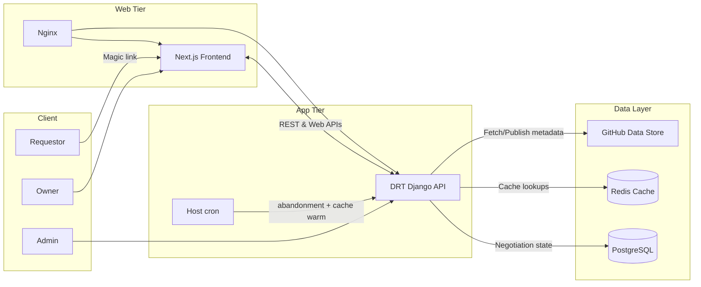

# DRT (Data Request Tracker) — Data Hub Implementation

> **Note:** This repository contains a **specific implementation** of the DRT platform for the Data Hub. The DRT platform itself is a general-purpose solution that can be deployed by any organization, data space, or research group. 

## Implementing Your Own DRT Instance

**Want to deploy DRT for your organization?** See the comprehensive **[Implementation Guide](docs/IMPLEMENTATION_GUIDE.md)** for step-by-step instructions on:
- Setting up your GitHub datastore
- Configuring backend and frontend
- Customizing branding and theming
- Deploying to production
- And much more

For information about the general DRT concept, see the [DRT landing page](https://github.com/ClimateSmartAgCollab/drt-ad) or contact us to form a partnership.

DRT is an end-to-end platform for managing data access negotiations between requestors and dataset owners. It streamlines how research teams discover questionnaires, submit structured requests, collaborate with owners, negotiate license terms, and archive the final agreements. This repository contains the Data Hub's production implementation, delivered as a full-stack monorepo that contains the production application, infrastructure assets, and supporting documentation.

---

## Table of Contents
- [Implementing Your Own DRT Instance](#-implementing-your-own-drt-instance)
- [Core Problem DRT Solves](#core-problem-it-solves)
- [Core Value Proposition](#core-value-proposition)
- [System Architecture](#system-architecture)
- [Platform Capabilities](#platform-capabilities)
- [Domain Workflow](#domain-workflow)
- [Module Overview](#module-overview)
- [Data Model Highlights](#data-model-highlights)
- [Environment & Configuration](#environment--configuration)
- [Local Development](#local-development)
- [Deployment & Operations](#deployment--operations)
- [Project Structure](#project-structure)
- [Resources & Contacts](#resources--contacts)

---

## Core Problem DRT Solves

Traditional data sharing in research relies on:
- Manual email chains
- Unstructured requests
- Lost documentation
- No audit trails
- Inconsistent approval processes

DRT replaces this chaos with a structured, transparent, automated workflow that maintains compliance with data governance principles while supporting FAIR data principles (Findable, Accessible, Interoperable, Reusable).

---

## Core Value Proposition
- **requestor-centric workflow:** requestors discover datasets, complete guided questionnaires, and track negotiations in one place.
- **Owner-centric workflow:** owners receive structured submissions, collaborate asynchronously, and approve or reject with clear audit trails.
- **Automatic license generation:** approved negotiations produce artifacts that are emailed to stakeholders (automated archival is planned).
- **GitHub-backed source of truth:** static assets (questionnaires, license templates, metadata) are versioned in GitHub, while dynamic state lives in PostgreSQL.
- **Human-friendly access control:** email links verification replaces heavyweight accounts for requestors and owners while preserving security.

---

## System Architecture

**Staging is a small production, not a shared Local.** One deploy shape, stripped down for the Local. `drt-test` is the only remote host today; a future prod host copies the same Compose file with a **derived** env (sandbox secrets replaced, not a flipped `TESTING_MODE` on prod keys).

| | Local | Staging (`drt-test`) | Production (future host) |
| --- | --- | --- | --- |
| Purpose | Edit → refresh | Does the real stack work? | Users |
| Compose | `infra/docker-compose.yml` (Postgres + Redis) | `infra/docker-compose.prod.yml` | Same file |
| Apps | Django `runserver` + Next `npm run dev` on the host | gunicorn + `npm start` + nginx | Same as staging |
| Env file | `.env` | `.env.production` | `.env.production` |
| Settings | `drt_core.settings.local` | `drt_core.settings.production` | `drt_core.settings.production` |
| `TESTING_MODE` / `ENVIRONMENT` | `true` / `development` | `true` / `staging` | `false` / `production` |
| Background | In-request | In-request + host cron | In-request + host cron |


```mermaid
graph LR;
    subgraph Client
        Requestor
        Owner
        Admin
    end
    subgraph Web Tier
        Frontend[Next.js Frontend]
        Nginx
    end
    subgraph App Tier
        Django[DRT Django API]
        Cron[Host cron]
    end
    subgraph Data Layer
        Postgres[(PostgreSQL)]
        Redis[(Redis Cache)]
        GitHub[GitHub Data Store]
    end

    Requestor -->|Magic link| Frontend
    Owner --> Frontend
    Admin --> Django
    Frontend <-->|REST & Web APIs| Django
    Django -->|Negotiation state| Postgres
    Django -->|Cache lookups| Redis
    Django -->|Fetch/Publish metadata| GitHub
    Cron -->|abandonment + cache warm| Django
    Nginx --> Frontend
    Nginx --> Django
```

**Key architectural decisions**
- **Separation of dynamic vs. static data:** PostgreSQL tracks negotiations and auditing, while GitHub holds immutable datasets, questionnaires, and license templates.
- **Caching strategy:** Redis caches frequently accessed GitHub payloads and owner lookups to reduce API calls and improve response times.
- **In-request work:** email, license generation, and cache refresh run in the Django process. Keep `EMAIL_TIMEOUT` at 5–10s so a hung SMTP call cannot occupy a gunicorn worker for the full 120s timeout.
- **Scheduled jobs:** host cron on remote boxes runs `process_abandonment_policy` (02:00) and `refresh_datastore_cache` (every 12 hours) via `infra/cron/run-job.sh`. Local has no cron.
- **Composable UI:** the Next.js frontend consumes the Django API and reuses shared design tokens for multiple client themes.
- See `docs/cache-architecture.md` for a deeper dive into GitHub-backed caching and refresh flows.

---

## Platform Capabilities
- **Guided data requests:** requestors receive dataset-specific questionnaires with branching logic and inline guidance.
- **Negotiation lifecycle:** owners review submissions, request clarifications, reject with rationale, or approve and trigger license generation.
- **Email workflows:** automated notifications (verification, reminders, approvals, rejections) keep both parties informed.
- **License automation:** finalized negotiations produce licenses that are distributed via email (automated archival remains on the roadmap).
- **Self-serve dashboards:** role-specific dashboard views summarize open negotiations, outstanding actions, and historical archives.
- **Analytics hooks:** summary statistics aggregate negotiation activity by owner, dataset, and tags for operational reporting.

---

## Domain Workflow
1. **Access initiation**
   - Requestors receive a UUID-backed email link, no heavy account creation, and land on the questionnaire tailored to the dataset.
   - Owners join via invitation links tied to `NLink` records in GitHub data store.
2. **Questionnaire completion**
   - The frontend renders dynamic JSON schemas fetched from the GitHub data store, cached in Redis for 24 hours to avoid rate limits.
   - Responses persist in PostgreSQL as part of the `Negotiation` entity.
3. **Owner review**
   - The dataset owner receives notification via email. They access the owner portal using their invitation link (`NLink` record). Owners review submissions, request clarifications (triggers an email back to the requestor), reject with rationale (archived with reason), or Approve (triggers license generation) via the Next.js negotiation workspace.
   - Each state transition is stored and archived; notifications are sent in-request (`backend/drt/tasks.py`).
4. **License issuance**
   - Approval flows call `generate_license_and_notify_owner` to produce the license using Jinja templates and email it to the owner.
   - (Planned) Automatic archival of generated licenses to GitHub is not yet implemented; artifacts are currently delivered via email only.
5. **Archival & analytics**
   - Every significant change is recorded in the `Archive` table, enabling historical review.
   - `SummaryStatistic` records aggregated for reporting.
   - Dashboards display: Open negotiations, Pending actions, Historical trends, Outcomes by dataset/owner/tags

---

## Module Overview
- **`backend/drt_core` & `backend/drt` (Django)**
  - API endpoints, negotiation models, and in-request email/license helpers.
  - Management commands for abandonment policy and datastore cache refresh.
  - Email templates and utilities for owner/requestor communications.
- **`backend/datastore`**
  - Gateway for GitHub-hosted questionnaire assets and metadata.
  - Cache-aware fetch routines used by the API and the cache-refresh command.
- **`frontend/app` (Next.js 14 / App Router)**
  - Requestor and owner flows, dashboards, and shared components.
  - Theming via `frontend/theme/tokens.*.ts`.
  - REST client wrappers inside `frontend/app/api/apiHelper.ts`.
- **`infra`**
  - Local Compose (`docker-compose.yml`) for Postgres + Redis. Remote Compose (`docker-compose.prod.yml`) for gunicorn, Next, nginx, Postgres, Redis. Host cron wrapper in `infra/cron/`.
- **`docs`**
  - Living design documentation, architecture notes, and ADRs.

---

## Data Model Highlights
The core entities live in `backend/drt/models.py`.

- **`NLink`** – ties dataset metadata (labels, tags) to a negotiation, and stores requestor/owner email links and expiration policy.
- **`Requestor`** – tracks verification and email identity for inbound requests.
- **`Negotiation`** – stores request/response JSON payloads, comments, reminders, state machine values, and submission versions.
- **`Archive`** – append-only history of negotiation snapshots, with `changed_by` and `change_description` metadata.
- **`SummaryStatistic`** – aggregates negotiation outcomes for analytics.

> Detailed ERDs and flowcharts are available in `docs/` and the linked GitHub design repository (see [Resources](#resources--contacts)).

---

## Environment & Configuration

Settings modules: **local** uses `drt_core.settings.local`; **staging and production** use `drt_core.settings.production`. Copy [`.env.example`](.env.example) to `.env` (laptop) or `.env.production` (any remote host). Fill values per host; do not reuse secrets. App behavior follows `TESTING_MODE` and `ENVIRONMENT` inside the file. Compose always injects `.env.production`.

### Local development (`.env`)

| Variable | Purpose |
| --- | --- |
| `DJANGO_SECRET_KEY` | Core Django secret (unique per host) |
| `POSTGRES_*` + `DB_HOST` / `DB_PORT` | PostgreSQL connectivity (or set `DATABASE_URL` to override) |
| `USE_SQLITE` | Set `true` for quick SQLite-only runs |
| `REDIS_URL` | Django cache (`127.0.0.1:6380` locally) |
| `FRONTEND_BASE_URL` | Used in emails for deep links |
| `GITHUB_API_URL` | GitHub API URL for datastore repository (format: `https://api.github.com/repos/OWNER/REPO/contents`) |
| `GITHUB_TOKEN` | GitHub personal access token for datastore access |
| `EMAIL_*` / `ETHEREAL_*` | SMTP or Ethereal sandbox credentials |
| `EMAIL_TIMEOUT` | SMTP hang bound in seconds (default `10`) |
| `TESTING_MODE` | Homepage banner + `/drt/public-config/` sandbox fields |
| `ENVIRONMENT` | Log label only (`development` / `staging` / `production`) |
| `ADMIN_EMAILS` | Comma-separated list of admin email addresses |
| `ADMIN_ENABLED` | Enable/disable admin functionality (`true`/`false`) |
| `NEXT_PUBLIC_API_URL` | Frontend → API endpoint (`frontend/.env.local`) |

### Remote (`.env.production`)

| Variable | Purpose |
| --- | --- |
| `POSTGRES_DB`, `POSTGRES_USER`, `POSTGRES_PASSWORD`, `POSTGRES_HOST` | Required database connection (production settings do **not** use `DATABASE_URL` or `DB_HOST`) |
| `POSTGRES_SCHEMA` | PostgreSQL schema for DRT tables (default `public`; use a dedicated schema when sharing a managed database) |
| `POSTGRES_CONN_MAX_AGE` | Connection pool lifetime in seconds (default `600`) |
| `DJANGO_ALLOWED_HOSTS`, `CSRF_TRUSTED_ORIGINS` | Host and CSRF configuration |
| `REDIS_URL` | Django cache (`redis://redis:6379/1` on the Compose network) |
| `EMAIL_*` | SMTP (Ethereal/sandbox on staging; real provider on production — never staging keys) |
| `CRON_HEALTHCHECK_*_URL` | Optional Healthchecks.io ping URLs for host cron |

See [docs/IMPLEMENTATION_GUIDE.md](docs/IMPLEMENTATION_GUIDE.md) Step 6.3 and Step 9.2 for schema support and the full production checklist.

**Secrets management (derived, not copied)**
- Copy [`.env.example`](.env.example) to the runtime file for that host and fill values. Never clone production secrets onto `drt-test` and flip `TESTING_MODE`.
- Each host needs its own `DJANGO_SECRET_KEY`, database password, SMTP credentials, ContextHub API key, and GitHub token/webhook secret.
- Copy `frontend/env.local.example` to `frontend/.env.local` on the laptop.

---

## Local Development

Same pattern as ContextHub: Docker runs **only Postgres and Redis**. Django and Next.js run on the host via `npm run dev`. Root npm scripts call `backend/.venv` through `scripts/venv-python.js`, so you do not activate the virtualenv in your shell.

```bash
# First time
npm run setup:backend
npm --prefix frontend install

# Every session
docker compose -f infra/docker-compose.yml up -d
npm run migrate
npm run dev
```

| Script | Purpose |
| --- | --- |
| `npm run setup:backend` | Create `backend/.venv` if missing (prefers Python 3.12 or 3.13) and install `backend/requirements.txt` |
| `npm run migrate` | `manage.py migrate` via that venv |
| `npm run manage -- <cmd>` | Any other Django command (e.g. `createsuperuser`) |
| `npm run dev` | Next on **3001** and Django `runserver` on **8000** |

- Backend: `http://127.0.0.1:8000`
- Frontend: `http://127.0.0.1:3001`
- Stop apps: Ctrl+C in the `npm run dev` terminal
- Stop databases: `docker compose -f infra/docker-compose.yml down`

If `npm run migrate` or `npm run dev` fails with `Backend virtualenv not found`, run `npm run setup:backend` first. If the venv was created with Python 3.14 (or another version outside 3.12–3.13), delete `backend/.venv` and rerun `setup:backend`.

Email, license generation, and cache refresh run in-request. There is no Celery.

**Fully containerized stack** (images, nginx, TLS) is remote only (`drt-test` today):

```bash
docker compose -f infra/docker-compose.prod.yml up -d --build
```


---

## Deployment & Operations
- **Containers:** Local Compose (`infra/docker-compose.yml`) is Postgres + Redis only. Remote apps use `infra/docker-compose.prod.yml` with `.env.production` on both `drt-test` and a future prod host.
- **Database:** Production requires `POSTGRES_*` variables (`POSTGRES_HOST`, not `DB_HOST`). Set `POSTGRES_SCHEMA=public` for a dedicated database, or a custom schema name when sharing a managed PostgreSQL instance (create the schema before migrate).
- **Reverse proxy:** Nginx terminates TLS (80/443) and routes traffic to frontend/backend services.
- **Static files:** the backend entrypoint runs `collectstatic` when `DJANGO_MANAGE_MIGRATE=on`. On a laptop: `npm run manage -- collectstatic`.
- **Email delivery:** Ethereal (or equivalent sandbox) on local/staging; real SMTP on production. Never reuse staging SMTP on production.
- **Cron (remote only):** `infra/cron/run-job.sh abandonment` at 02:00 and `… cache` every 12 hours. Optional Healthchecks.io URLs in the app env file ping on success and `<url>/fail` on failure.
- **Disaster recovery:** PostgreSQL volume backups plus GitHub as authoritative store for questionnaires, license templates, and other static assets.

---

## Project Structure
- `backend/` – Django API, static assets, management commands.
- `frontend/` – Next.js client, shared components, theming, and API helpers.
- `scripts/` – `venv-python.js` so root npm scripts use `backend/.venv` without activating it.
- `infra/` – Docker Compose files, Dockerfiles, and host cron wrapper.
- `docs/` – architecture notes, diagrams, ADRs.
- `LICENCE` – project licensing.

---

## Resources & Contacts
- **Implementation Guide:** [docs/IMPLEMENTATION_GUIDE.md](docs/IMPLEMENTATION_GUIDE.md) - Complete guide for deploying your own DRT instance
- **Production datastore (example):** [ClimateSmartAgCollab/DRT-DS-test](https://github.com/ClimateSmartAgCollab/DRT-DS-test)
- **Design documentation:** see `docs/` within this repository.
- **Support:** `adc@uoguelph.ca`
- **Project leadership:** reach the Data Request Tool maintainers via the Climate Smart Ag Collaboration working group.

---

> Need more context or bespoke onboarding material? Let the maintainers know what would help and we will expand the documentation accordingly.
