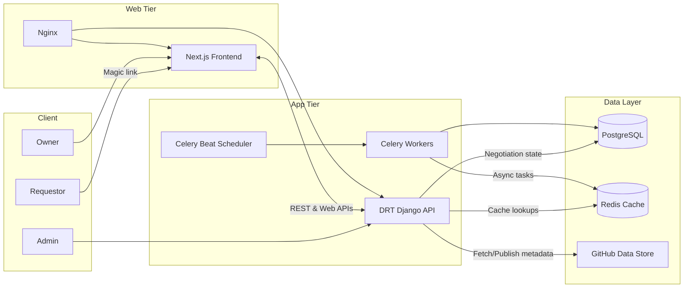

# DRT (Data Request Tracker) — Data Hub Implementation

> **Note:** This repository contains a **specific implementation** of the DRT platform for the Data Hub. The DRT platform itself is a general-purpose solution that can be deployed by any organization, data space, or research group. 

## Implementing Your Own DRT Instance

**Want to deploy DRT for your organization?** See the comprehensive **[Implementation Guide](docs/IMPLEMENTATION_GUIDE.md)** for step-by-step instructions on:
- Setting up your GitHub datastore
- Configuring backend and frontend
- Customizing branding and theming
- Deploying to production
- And much more

For information about the general DRT concept, see the [DRT landing page](https://github.com/ClimateSmartAgCollab/drt-ad) or contact us to form a partnership.

DRT is an end-to-end platform for managing data access negotiations between requestors and dataset owners. It streamlines how research teams discover questionnaires, submit structured requests, collaborate with owners, negotiate license terms, and archive the final agreements. This repository contains the Data Hub's production implementation, delivered as a full-stack monorepo that contains the production application, infrastructure assets, and supporting documentation.

---

## Table of Contents
- [Implementing Your Own DRT Instance](#-implementing-your-own-drt-instance)
- [Core Problem DRT Solves](#core-problem-it-solves)
- [Core Value Proposition](#core-value-proposition)
- [System Architecture](#system-architecture)
- [Platform Capabilities](#platform-capabilities)
- [Domain Workflow](#domain-workflow)
- [Module Overview](#module-overview)
- [Data Model Highlights](#data-model-highlights)
- [Environment & Configuration](#environment--configuration)
- [Local Development](#local-development)
- [Deployment & Operations](#deployment--operations)
- [Project Structure](#project-structure)
- [Resources & Contacts](#resources--contacts)

---

## Core Problem DRT Solves

Traditional data sharing in research relies on:
- Manual email chains
- Unstructured requests
- Lost documentation
- No audit trails
- Inconsistent approval processes

DRT replaces this chaos with a structured, transparent, automated workflow that maintains compliance with data governance principles while supporting FAIR data principles (Findable, Accessible, Interoperable, Reusable).

---

## Core Value Proposition
- **requestor-centric workflow:** requestors discover datasets, complete guided questionnaires, and track negotiations in one place.
- **Owner-centric workflow:** owners receive structured submissions, collaborate asynchronously, and approve or reject with clear audit trails.
- **Automatic license generation:** approved negotiations produce artifacts that are emailed to stakeholders (automated archival is planned).
- **GitHub-backed source of truth:** static assets (questionnaires, license templates, metadata) are versioned in GitHub, while dynamic state lives in PostgreSQL.
- **Human-friendly access control:** email links verification replaces heavyweight accounts for requestors and owners while preserving security.

---

## System Architecture

DRT is composed of independently deployable services orchestrated via Docker Compose in development and container platforms in production.


```mermaid
graph LR;
    subgraph Client
        Requestor
        Owner
        Admin
    end
    subgraph Web Tier
        Frontend[Next.js Frontend]
        Nginx
    end
    subgraph App Tier
        Django[DRT Django API]
        CeleryWorker[Celery Workers]
        CeleryBeat[Celery Beat Scheduler]
    end
    subgraph Data Layer
        Postgres[(PostgreSQL)]
        Redis[(Redis Cache)]
        GitHub[GitHub Data Store]
    end

    Requestor -->|Magic link| Frontend
    Owner --> Frontend
    Admin --> Django
    Frontend <-->|REST & Web APIs| Django
    Django -->|Negotiation state| Postgres
    Django -->|Cache lookups| Redis
    Django -->|Fetch/Publish metadata| GitHub
    CeleryWorker -->|Async tasks| Redis
    CeleryWorker --> Postgres
    CeleryBeat --> CeleryWorker
    Nginx --> Frontend
    Nginx --> Django
```

**Key architectural decisions**
- **Separation of dynamic vs. static data:** PostgreSQL tracks negotiations and auditing, while GitHub holds immutable datasets, questionnaires, and license templates.
- **Caching strategy:** Redis caches frequently accessed GitHub payloads and owner lookups to reduce API calls and improve response times.
- **Task orchestration:** Celery handles outbound email, cache warmups, periodic GitHub polling, and license generation without blocking web traffic.
- **Composable UI:** the Next.js frontend consumes the Django API and reuses shared design tokens for multiple client themes.
- See `docs/cache-architecture.md` for a deeper dive into GitHub-backed caching and refresh flows.

---

## Platform Capabilities
- **Guided data requests:** requestors receive dataset-specific questionnaires with branching logic and inline guidance.
- **Negotiation lifecycle:** owners review submissions, request clarifications, reject with rationale, or approve and trigger license generation.
- **Email workflows:** automated notifications (verification, reminders, approvals, rejections) keep both parties informed.
- **License automation:** finalized negotiations produce licenses that are distributed via email (automated archival remains on the roadmap).
- **Self-serve dashboards:** role-specific dashboard views summarize open negotiations, outstanding actions, and historical archives.
- **Analytics hooks:** summary statistics aggregate negotiation activity by owner, dataset, and tags for operational reporting.

---

## Domain Workflow
1. **Access initiation**
   - Requestors receive a UUID-backed email link, no heavy account creation, and land on the questionnaire tailored to the dataset.
   - Owners join via invitation links tied to `NLink` records in GitHub data store.
2. **Questionnaire completion**
   - The frontend renders dynamic JSON schemas fetched from the GitHub data store, cached in Redis for 24 hours to avoid rate limits.
   - Responses persist in PostgreSQL as part of the `Negotiation` entity.
3. **Owner review**
   - The dataset owner receives notification via email. They access the owner portal using their invitation link (`NLink` record). Owners review submissions, request clarifications (triggers an email back to the requestor), reject with rationale (archived with reason), or Approve (triggers license generation) via the Next.js negotiation workspace.
   - Each state transition is stored and archived; Celery dispatches notifications (`backend/drt/tasks.py`).
4. **License issuance**
   - Approval flows call `generate_license_and_notify_owner` to produce the license using Jinja templates and email it to the owner.
   - (Planned) Automatic archival of generated licenses to GitHub is not yet implemented; artifacts are currently delivered via email only.
5. **Archival & analytics**
   - Every significant change is recorded in the `Archive` table, enabling historical review.
   - `SummaryStatistic` records aggregated for reporting.
   - Dashboards display: Open negotiations, Pending actions, Historical trends, Outcomes by dataset/owner/tags

---

## Module Overview
- **`backend/drt_core` & `backend/drt` (Django)**
  - API endpoints, negotiation models, and Celery task definitions.
  - Management commands for cache maintenance and GitHub synchronization.
  - Email templates and utilities for owner/requestor communications.
- **`backend/datastore`**
  - Gateway for GitHub-hosted questionnaire assets and metadata.
  - Cache-aware fetch routines reused by Celery.
- **`frontend/app` (Next.js 14 / App Router)**
  - Requestor and owner flows, dashboards, and shared components.
  - Theming via `frontend/theme/tokens.*.ts`.
  - REST client wrappers inside `frontend/app/api/apiHelper.ts`.
- **`infra`**
  - Dockerfiles and `docker-compose.yml` for local orchestration of PostgreSQL, Redis, Django, Celery, frontend, and Nginx.
- **`docs`**
  - Living design documentation, architecture notes, and ADRs.

---

## Data Model Highlights
The core entities live in `backend/drt/models.py`.

- **`NLink`** – ties dataset metadata (labels, tags) to a negotiation, and stores requestor/owner email links and expiration policy.
- **`Requestor`** – tracks verification and email identity for inbound requests.
- **`Negotiation`** – stores request/response JSON payloads, comments, reminders, state machine values, and submission versions.
- **`Archive`** – append-only history of negotiation snapshots, with `changed_by` and `change_description` metadata.
- **`SummaryStatistic`** – aggregates negotiation outcomes for analytics.

> Detailed ERDs and flowcharts are available in `docs/` and the linked GitHub design repository (see [Resources](#resources--contacts)).

---

## Environment & Configuration

| Variable | Purpose | Location |
| --- | --- | --- |
| `DJANGO_SECRET_KEY` | Core Django secret | `backend/.env` |
| `DATABASE_URL` or (`POSTGRES_*`, `DB_HOST`, `DB_PORT`) | Database connectivity | `backend/.env`, `backend/local.env` |
| `REDIS_URL` | Celery broker + cache | `backend/.env` |
| `FRONTEND_BASE_URL` | Used in emails for deep links | `backend/.env` |
| `GITHUB_API_URL` | GitHub API URL for datastore repository (format: `https://api.github.com/repos/OWNER/REPO/contents`) | `backend/.env` |
| `GITHUB_TOKEN` | GitHub personal access token for datastore access | `backend/.env` |
| `EMAIL_*` (`DEFAULT_FROM_EMAIL`, `ETHEREAL_USER`, etc.) | SMTP credentials | `backend/.env` |
| `NEXT_PUBLIC_API_BASE_URL` | Frontend → API endpoint | `frontend/.env.local` |

**Secrets management**
- Copy `backend/env.example` to `.env` and populate sensitive values.
- Copy `frontend/env.local.example` to `.env.local`.
- When running via Docker Compose, `.env` files at the repository root provide shared defaults.

---

## Local Development

### Option A — Docker Compose
```bash
cd infra
docker compose up --build
```
- Backend: `http://127.0.0.1:8000`
- Frontend: `http://127.0.0.1:3000`
- Postgres and Redis volumes persist across runs (`db_data`, `redis_data`).

### Option B — Manual run
```bash
# Backend
cd backend
pip install -r requirements.txt
cp env.example .env
python manage.py migrate
python manage.py runserver 0.0.0.0:8000

# Frontend
cd frontend
npm install
cp env.local.example .env.local
npm run dev
```

**Celery workers**
```bash
celery -A drt_core worker --loglevel=info
celery -A drt_core beat --loglevel=info
```
Use `redis-server` or the Docker container to provide the broker/backend.

---

## Deployment & Operations
- **Containers:** Build images from `infra/docker/backend.Dockerfile` (Django/Celery) and `frontend/frontend.Dockerfile`.
- **Reverse proxy:** Nginx terminates TLS (80/443) and routes traffic to frontend/backend services.
- **Static files:** `python manage.py collectstatic` prior to production deploy to upload assets.
- **Email delivery:** external SMTP provider (Ethereal for staging, production provider TBD).
- **Monitoring hooks:** extendable via Django signals and Celery task logging; integrate with preferred observability stack.
- **Disaster recovery:** PostgreSQL volume backups plus GitHub as authoritative store for questionnaires, license templates, and other static assets.

---

## Project Structure
- `backend/` – Django API, Celery apps, static assets, management commands.
- `frontend/` – Next.js client, shared components, theming, and API helpers.
- `infra/` – Docker Compose file and Docker build contexts.
- `docs/` – architecture notes, diagrams, ADRs.
- `LICENCE` – project licensing.

---

## Resources & Contacts
- **Implementation Guide:** [docs/IMPLEMENTATION_GUIDE.md](docs/IMPLEMENTATION_GUIDE.md) - Complete guide for deploying your own DRT instance
- **Production datastore (example):** [ClimateSmartAgCollab/DRT-DS-test](https://github.com/ClimateSmartAgCollab/DRT-DS-test)
- **Design documentation:** see `docs/` within this repository.
- **Support:** `adc@uoguelph.ca`
- **Project leadership:** reach the Data Request Tool maintainers via the Climate Smart Ag Collaboration working group.

---

> Need more context or bespoke onboarding material? Let the maintainers know what would help and we will expand the documentation accordingly.
