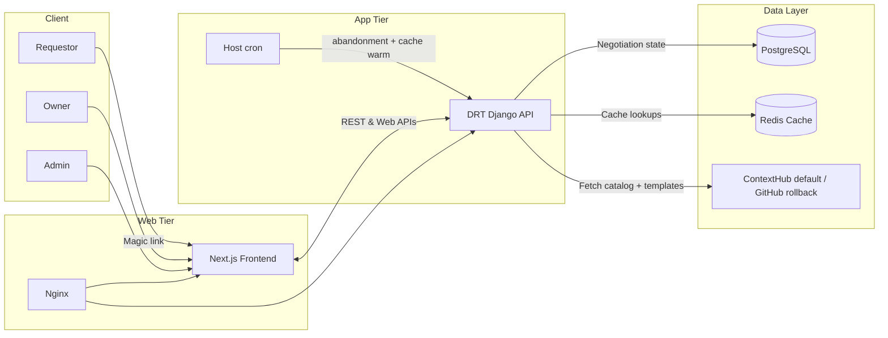

# Architecture

DRT (Data Request Tracker) is a full-stack platform for data-access negotiations between **requestors** and **dataset owners**. This document describes how the Data Hub implementation is put together. For clone-and-run steps, see the [root README](../README.md). For deploying your own instance, see the [Implementation Guide](IMPLEMENTATION_GUIDE.md).

Traditional research data sharing relies on email chains, unstructured requests, and missing audit trails. DRT replaces that with a structured workflow that supports FAIR data principles (Findable, Accessible, Interoperable, Reusable).

**Core bets**

- **Requestor-centric:** discover datasets, complete guided questionnaires, track negotiations in one place.
- **Owner-centric:** structured submissions, asynchronous review, approve or reject with an audit trail.
- **ContextHub as the default catalog:** questionnaires, license templates, and link/owner tables come from ContextHub (`DATASTORE_BACKEND` defaults to `contexthub`). GitHub is the rollback backend. Dynamic negotiation state lives in PostgreSQL.
- **Magic links instead of heavyweight accounts:** UUID-backed email links for requestors and owners. Those UUIDs are bookmarks, not credentials.
- **Row bind:** a session means someone is logged in, not that they own the open case. Fill, owner review (including GET and save), history, reopen, archive, delete, license download, and fulfillment require the session email to match that row — `owner_table[nlink.owner_id].owner_email` for owners, `NLink.requestor_email` for requestors. Both comparisons are case-insensitive (`emails_match`). The owner list, summary, and catalog links use the same match when resolving owner IDs. Helpers live in [`backend/drt/services/access.py`](../backend/drt/services/access.py).
- **Stored issued license:** approval renders Jinja once (sandboxed), persists the bytes on `Negotiation`, emails that body to owner and requestor, and serves that blob on download. Automated archival to GitHub is planned, not implemented.

---

## Environments

Staging is a small production, not a shared laptop. One deploy shape; a future prod host copies the same Compose file with **derived** secrets (sandbox credentials replaced — not a flipped `TESTING_MODE` on prod keys). `drt-test` is the only remote host today.

| | Local | Staging (`drt-test`) | Production (future host) |
| --- | --- | --- | --- |
| Purpose | Edit → refresh | Does the real stack work? | Users |
| Compose | `infra/docker-compose.yml` (Postgres, Redis, Mailpit) | `infra/docker-compose.prod.yml` (`--profile testing` starts Mailpit) | Same file; omit `--profile testing` |
| Apps | Django `runserver` + Next `npm run dev` on the host | gunicorn + `npm start` + nginx | Same as staging |
| Env file | `.env` | `.env.production` | `.env.production` |
| Settings | `drt_core.settings.local` | `drt_core.settings.production` | `drt_core.settings.production` |
| `TESTING_MODE` / `ENVIRONMENT` | `true` / `development` | `true` / `staging` | `false` / `production` |
| Background work | In-request | In-request + host cron | In-request + host cron |

`TESTING_MODE` and `ENVIRONMENT` live **inside** the env file. App behavior follows those values, not the filename.

---

## System diagram

---

## Key decisions

- **Dynamic vs static data.** PostgreSQL tracks negotiations and auditing. ContextHub (default) or GitHub (rollback) holds questionnaires, license templates, and catalog tables. DRT does not write catalog `status` back.
- **Caching.** Redis caches ContextHub / GitHub payloads and owner lookups. There is **no stale-on-error fallback** — operators rely on cron pre-warm (and the GitHub HMAC webhook when `DATASTORE_BACKEND=github`). Catalog link `status` lives in the cached `link_table`. Missing status is treated as `active`; any other value refuses **new** cases at `generate_nlinks` (in-flight negotiations continue). ContextHub has no status webhook — after a blob edit, run `manage.py refresh_datastore_cache` (force-rewarm). Details: [cache-architecture.md](cache-architecture.md).
- **In-request work.** Email, license generation, and cache refresh run in the Django process. There is no Celery. Keep `EMAIL_TIMEOUT` at 5–10s so a hung SMTP call cannot occupy a gunicorn worker for the full 120s timeout.
- **Scheduled jobs (remote only).** Host cron runs `process_abandonment_policy` (02:00) and `refresh_datastore_cache` (every 12 hours) via `infra/cron/run-job.sh`. Local has no cron.
- **Composable UI.** The Next.js frontend consumes the Django API and reuses shared design tokens for multiple client themes (`frontend/theme/tokens.*.ts`).

---

## Domain workflow

1. **Access initiation**
   - Requestors receive a UUID-backed email link (no account creation) and land on the questionnaire for that dataset.
   - Owners join via invitation links tied to `NLink` records populated from the cached catalog (ContextHub by default).
   - `GET /drt/generate_nlinks/<link_id>/` refuses a cached catalog `status` other than `active` with 403 `link_not_requestable`. The owner links list omits those doors so owners do not share a dead generate URL.
   - Closing a catalog door is not the same as withdrawing one requestor. DRT does not write `status` back to ContextHub, and withdrawing a case does not disable the blob.
2. **Questionnaire completion**
   - The frontend renders dynamic JSON schemas fetched from the datastore (ContextHub by default), cached in Redis (24h TTL).
   - Responses persist in PostgreSQL on the `Negotiation` entity.
3. **Owner review**
   - The owner is notified by email and opens the owner portal via their invitation link.
   - Opening review requires an owner session bound to that row. The existing email-verify modal runs before the GET; UUID links are not credentials.
   - They can request clarification (email back to the requestor), reject with rationale (archived), or approve (triggers license generation).
   - Each state transition is stored; notifications are sent in-request (`backend/drt/tasks.py`).
4. **License issuance**
   - Approval renders the Jinja template once with a sandboxed environment, persists the bytes on `Negotiation` (`issued_license_text`, SHA-256, SAID pin, version), and archives `Issued license vN`.
   - That stored body is emailed to the owner **and** the requestor. Download (`GET /drt/negotiations/regenerate-license/<id>/`) serves the stored artifact; it does not re-render the live template. Reopen leaves the last issued license until the next accept overwrites it.
   - Automatic archival of generated licenses to GitHub is **not** implemented.
5. **Archival and analytics**
   - Significant changes are recorded in `Archive`.
   - The owner **Summary Statistics** page live-aggregates `NLink` / `Negotiation` state counts for the signed-in owner (`GET /drt/summary-statistics/?group_by=true`). It reports request decisions, not file access, and it is not a historical time series.
   - Filters are tag **AND**, `data_label`, `record_label`, and a date window. The window defaults to **request created** (`Negotiation.timestamps`). Owners can switch it to **decided** (`Negotiation.decided_at`); rows with a null decision clock drop out of that mode.
   - Median time-to-first-look and time-to-decision are filter-scoped scalars over rows that have both clock ends. Sparse or missing clocks show an em dash and a sample size, not a fake 0-day SLA. `decided_at` / `abandoned_at` are **current-cycle** clocks: reopen clears them on purpose so the live row is the cycle in progress. First-decision SLA after a reopen remains in `Archive` (`Owner accepted` / `Owner rejected` + `archived_timestamp`).
   - Delivery KPIs (`pending` / `delivered` / `withdrawn`) are a second, filter-scoped strip over **accepted** rows only. They are top-level scalars, not mixed into grouped table rows. Historical accepted rows that stayed `not_applicable` are omitted from this strip and its click-through; they are not a delivery queue. Fulfillment is current-cycle (reopen clears it). There is still no access time series, and raw `accepted` is never relabeled as access granted.
   - The page shows queue / decided / abandoned KPIs (acceptance rate = accepted / (accepted + rejected)), median first-look / decision times, delivery cards, a stacked outcome mix (accepted / rejected / abandoned / still open), and a table. KPI cards and status counts click through to the owner list with matching `status`, `tags`, `record_label`, `data_label`, dates, and `dateField`. Delivery cards add `fulfillment_status`.
   - There is no stored aggregate table. Counts are always computed from live `NLink` / `Negotiation` rows. These figures are request decisions, not file access.

---

## Modules

- **`backend/drt_core` and `backend/drt` (Django)** — API, negotiation models, in-request email/license helpers, management commands for abandonment and cache refresh. Mutating endpoints enforce CSRF (`CSRFEnforcedSessionAuthentication` on DRF views; Django middleware on the rest).
- **`backend/datastore`** — gateway for ContextHub (default) or GitHub (rollback) questionnaires and metadata; cache-aware fetch used by the API and `refresh_datastore_cache`. HTTP dumps (`cached-data`, license table/template, questionnaire JSON) require an admin session. The GitHub webhook stays HMAC-gated and is disabled unless `DATASTORE_BACKEND=github`.
- **`frontend/app` (Next.js App Router)** — requestor and owner flows, dashboards, shared components. REST client: `frontend/app/api/apiHelper.ts`. Dynamic questionnaires: [`Form`](../frontend/app/components/Form/README.md) + [`parser`](../frontend/app/components/parser/README.md).
- **`infra`** — local Compose (Postgres, Redis, Mailpit); remote Compose (gunicorn, Next, nginx, Postgres, Redis; Mailpit on the `testing` profile); host cron wrapper. See [`infra/README.md`](../infra/README.md).

---

## Data model

Core entities live in `backend/drt/models.py`.

| Entity | Role |
| --- | --- |
| **`NLink`** | Ties a negotiation to questionnaire-package labels (`data_label`, `record_label`, `visible_label`, `tags`) and optional `dataset_ID`. Stores requestor/owner email links and expiration. |
| **`Requestor`** | Email identity and verification. The live magic-link token lives in Redis (`magic_token:{token}`) and in email; `Requestor.otp` is leftover and is not written. |
| **`Negotiation`** | Request/response JSON, comments, state machine, current-cycle clocks and fulfillment, issued license text / SHA-256 / SAID pin / version. States: `requestor_open`, `owner_open`, `accepted`, `archived`, `canceled`, `rejected`, `abandoned`. |
| **`Archive`** | Append-only snapshots of a negotiation, with `changed_by` and `change_description`. |

---

## Related docs

- [Implementation Guide](IMPLEMENTATION_GUIDE.md) — datastore setup, theming, production deploy
- [Cache architecture](cache-architecture.md) — ContextHub-default cache, GitHub webhook rollback, failure behavior
- [Infrastructure](../infra/README.md) — Compose files, cron, systemd
- [Backend](../backend/README.md) · [Frontend](../frontend/README.md)
