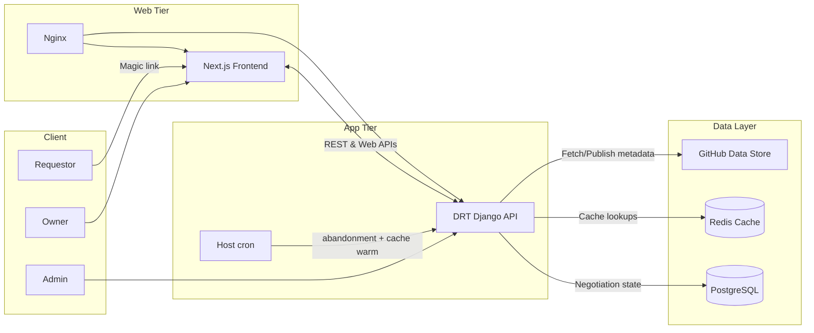

# Architecture

DRT (Data Request Tracker) is a full-stack platform for data-access negotiations between **requestors** and **dataset owners**. This document describes how the Data Hub implementation is put together. For clone-and-run steps, see the [root README](../README.md). For deploying your own instance, see the [Implementation Guide](IMPLEMENTATION_GUIDE.md).

Traditional research data sharing relies on email chains, unstructured requests, and missing audit trails. DRT replaces that with a structured workflow that supports FAIR data principles (Findable, Accessible, Interoperable, Reusable).

**Core bets**

- **Requestor-centric:** discover datasets, complete guided questionnaires, track negotiations in one place.
- **Owner-centric:** structured submissions, asynchronous review, approve or reject with an audit trail.
- **GitHub as source of truth for static assets:** questionnaires, license templates, and metadata live in a datastore repo. Dynamic negotiation state lives in PostgreSQL.
- **Magic links instead of heavyweight accounts:** UUID-backed email links for requestors and owners.
- **Automatic license generation:** approved negotiations produce artifacts that are emailed to stakeholders. Automated archival to GitHub is planned, not implemented.

---

## Environments

Staging is a small production, not a shared laptop. One deploy shape; a future prod host copies the same Compose file with **derived** secrets (sandbox credentials replaced — not a flipped `TESTING_MODE` on prod keys). `drt-test` is the only remote host today.

| | Local | Staging (`drt-test`) | Production (future host) |
| --- | --- | --- | --- |
| Purpose | Edit → refresh | Does the real stack work? | Users |
| Compose | `infra/docker-compose.yml` (Postgres, Redis, Mailpit) | `infra/docker-compose.prod.yml` (`--profile testing` starts Mailpit) | Same file; omit `--profile testing` |
| Apps | Django `runserver` + Next `npm run dev` on the host | gunicorn + `npm start` + nginx | Same as staging |
| Env file | `.env` | `.env.production` | `.env.production` |
| Settings | `drt_core.settings.local` | `drt_core.settings.production` | `drt_core.settings.production` |
| `TESTING_MODE` / `ENVIRONMENT` | `true` / `development` | `true` / `staging` | `false` / `production` |
| Background work | In-request | In-request + host cron | In-request + host cron |

`TESTING_MODE` and `ENVIRONMENT` live **inside** the env file. App behavior follows those values, not the filename.

---

## System diagram

---

## Key decisions

- **Dynamic vs static data.** PostgreSQL tracks negotiations and auditing. GitHub holds immutable datasets, questionnaires, and license templates.
- **Caching.** Redis caches GitHub payloads and owner lookups to stay under API rate limits. There is **no stale-on-error fallback** — operators rely on webhook + cron pre-warm. Details: [cache-architecture.md](cache-architecture.md).
- **In-request work.** Email, license generation, and cache refresh run in the Django process. There is no Celery. Keep `EMAIL_TIMEOUT` at 5–10s so a hung SMTP call cannot occupy a gunicorn worker for the full 120s timeout.
- **Scheduled jobs (remote only).** Host cron runs `process_abandonment_policy` (02:00) and `refresh_datastore_cache` (every 12 hours) via `infra/cron/run-job.sh`. Local has no cron.
- **Composable UI.** The Next.js frontend consumes the Django API and reuses shared design tokens for multiple client themes (`frontend/theme/tokens.*.ts`).

---

## Domain workflow

1. **Access initiation**
   - Requestors receive a UUID-backed email link (no account creation) and land on the questionnaire for that dataset.
   - Owners join via invitation links tied to `NLink` records populated from the GitHub datastore.
2. **Questionnaire completion**
   - The frontend renders dynamic JSON schemas fetched from GitHub, cached in Redis (24h TTL).
   - Responses persist in PostgreSQL on the `Negotiation` entity.
3. **Owner review**
   - The owner is notified by email and opens the owner portal via their invitation link.
   - They can request clarification (email back to the requestor), reject with rationale (archived), or approve (triggers license generation).
   - Each state transition is stored; notifications are sent in-request (`backend/drt/tasks.py`).
4. **License issuance**
   - Approval calls `generate_license_and_notify_owner`, which renders a Jinja template and emails the license.
   - Automatic archival of generated licenses to GitHub is **not** implemented; artifacts are email-only today.
5. **Archival and analytics**
   - Significant changes are recorded in `Archive`.
   - `SummaryStatistic` aggregates outcomes for reporting.
   - Dashboards show open negotiations, pending actions, historical trends, and outcomes by dataset / owner / tags.

---

## Modules

- **`backend/drt_core` and `backend/drt` (Django)** — API, negotiation models, in-request email/license helpers, management commands for abandonment and cache refresh.
- **`backend/datastore`** — gateway for GitHub-hosted questionnaires and metadata; cache-aware fetch used by the API and `refresh_datastore_cache`.
- **`frontend/app` (Next.js App Router)** — requestor and owner flows, dashboards, shared components. REST client: `frontend/app/api/apiHelper.ts`. Dynamic questionnaires: [`Form`](../frontend/app/components/Form/README.md) + [`parser`](../frontend/app/components/parser/README.md).
- **`infra`** — local Compose (Postgres, Redis, Mailpit); remote Compose (gunicorn, Next, nginx, Postgres, Redis; Mailpit on the `testing` profile); host cron wrapper. See [`infra/README.md`](../infra/README.md).

---

## Data model

Core entities live in `backend/drt/models.py`.

| Entity | Role |
| --- | --- |
| **`NLink`** | Ties dataset metadata (labels, tags) to a negotiation. Stores requestor/owner email links and expiration. |
| **`Requestor`** | Email identity, OTP, and verification for inbound requests. |
| **`Negotiation`** | Request/response JSON, comments, reminders, state machine, submission version. States: `requestor_open`, `owner_open`, `accepted`, `archived`, `canceled`, `rejected`, `abandoned`. |
| **`Archive`** | Append-only snapshots of a negotiation, with `changed_by` and `change_description`. |
| **`SummaryStatistic`** | Aggregated outcomes for analytics. |

---

## Related docs

- [Implementation Guide](IMPLEMENTATION_GUIDE.md) — datastore setup, theming, production deploy
- [Cache architecture](cache-architecture.md) — GitHub-backed cache, webhooks, failure behavior
- [Infrastructure](../infra/README.md) — Compose files, cron, systemd
- [Backend](../backend/README.md) · [Frontend](../frontend/README.md)
