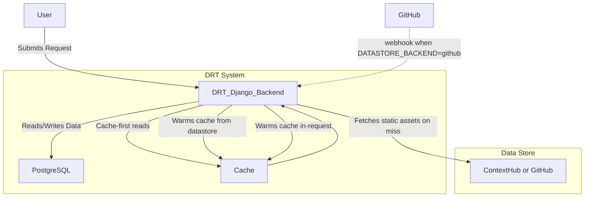
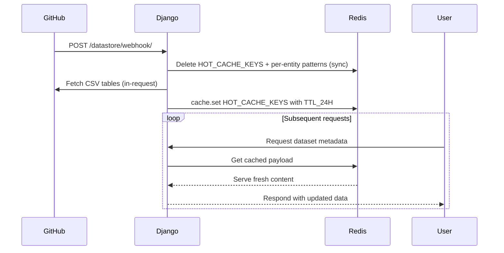
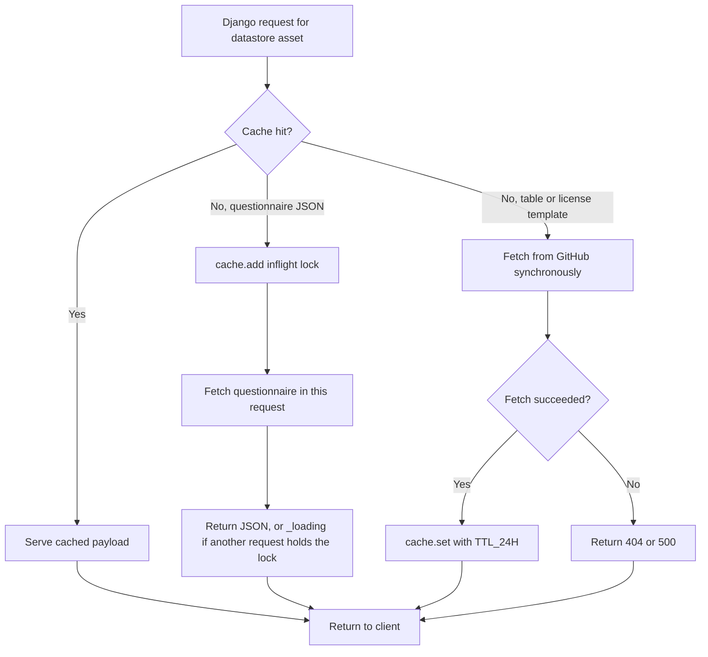
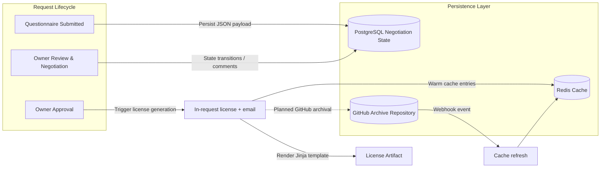
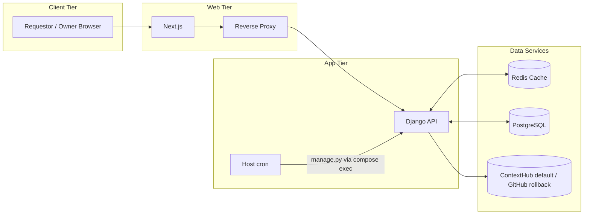

# Cache architecture

ContextHub is the default catalog (`DATASTORE_BACKEND=contexthub`). GitHub is the rollback backend; the HMAC webhook applies only then. System-wide picture: [ARCHITECTURE.md](ARCHITECTURE.md). Clone-and-run: [root README](../README.md).

## Cache-backed data flow

---

## Diagram Walkthrough

- **User Interaction:** Users submit requests through the Django web service (e.g., completing questionnaires or negotiating licenses).
- **Cache-first Reads:** Django checks the cache for recently accessed catalog assets before reaching ContextHub (default) or GitHub (rollback).
- **Cache Refresh:** The selected datastore is the source of truth for static content. Host cron re-warms every 12 hours (`infra/cron/run-job.sh cache`). ContextHub has no DRT webhook — after a blob edit, run `manage.py refresh_datastore_cache`. When `DATASTORE_BACKEND=github`, GitHub changes can also trigger refresh via the HMAC webhook.
- **Dynamic State:** Negotiation data lives in PostgreSQL, and Django reads/writes relational state there throughout the workflow.
- **Datastore Reads:** When cached content is missing, Django fetches the questionnaire or license template from the active backend and stores the result in Redis for next time. For questionnaires, the process that wins the inflight lock fetches synchronously and returns JSON; concurrent requests may still see `_loading` until that fetch completes.
- **Issued license:** Approval persists the rendered bytes on `Negotiation`. Download serves that stored blob; it does not re-render. Automated upload of generated licenses to GitHub is not implemented.
- **Failure Behavior:** There is **no stale-on-error fallback**. If a datastore fetch fails on a cold key, the endpoint returns 404/500 (or keeps returning `_loading` until the inflight fetch succeeds). Operators should rely on cron (and the GitHub webhook when that backend is on), not stale-serve semantics.

---

## Full Workflow Summary

1. **Request Submission:** Requestors access DRT through UUID-backed links and submit data via dynamic questionnaires served by Django.
2. **Cache Coordination:** Django retrieves questionnaire metadata and related assets from the cache; cache misses fall back to ContextHub (or GitHub) and repopulate the cache.
3. **Datastore Synchronization:** Host cron runs `refresh_datastore_cache` every 12 hours. ContextHub has no DRT webhook. When `DATASTORE_BACKEND=github`, GitHub changes can also trigger refresh via the HMAC webhook.
4. **Negotiation Management:** Negotiation states, conversations, and reminders reside in PostgreSQL, orchestrated by Django (email and license work run in-request).
5. **Artifact Delivery:** Completed negotiations persist the issued license on `Negotiation` and email that stored body to owner and requestor. Download serves the stored blob. System-side archival to GitHub is not implemented.
6. **Ongoing Serving:** Subsequent requests benefit from cached data, reducing datastore traffic while ensuring freshness when updates occur.

---

## Cache Refresh Sequence

GitHub webhook path (`DATASTORE_BACKEND=github` only). ContextHub has no DRT webhook; use `manage.py refresh_datastore_cache`.

### Notes

- Invalidation and repopulation both run in the Django request that handles the webhook. Concurrent requests can miss until that warm finishes.
- Webhooks are preferred; `infra/cron/run-job.sh cache` (every 12 hours) ensures the cache is refilled even if no webhook arrives.
- Cache keys and TTLs are defined in `backend/datastore/cache_keys.py`. Use the constants and helpers from that module rather than re-typing string literals.

---

## Data Fetch Decision Tree

### Notes

- All catalog assets share a uniform 24-hour TTL (`TTL_24H` in `cache_keys.py`). Freshness is driven by cron (and the GitHub webhook when that backend is on), not by TTL expiry.
- There is **no stale fallback**. A datastore outage either keeps serving cache-warm content until the next invalidation, or surfaces 404/500 once keys are missing. Build a runbook around this rather than relying on graceful degradation.
- Questionnaire JSON uses an inflight lock: the request that wins the lock fetches now; other concurrent requests may see `_loading`. List endpoints read cache-only and never fetch the datastore inline.

---

## Negotiation Artifact Flow

### Notes

- Negotiation events remain in PostgreSQL; generated licenses are currently distributed via email. GitHub archival is an open roadmap item.
- License generation reads `owner_table` and `license_template_{id}` from Redis (and lazily fetches+caches the template on miss). It does **not** warm negotiation list state -- the negotiation list is driven by PostgreSQL plus React Query invalidation, not by Redis.

---

## Operational Topology Overview

### Notes

- Redis backs the Django cache (DB index `/1`). PostgreSQL connectivity uses explicit `POSTGRES_*` settings with optional `POSTGRES_SCHEMA` (see `backend/drt_core/settings/production.py` and `docs/IMPLEMENTATION_GUIDE.md` Step 6.3). Local development uses the same cache Redis on host port 6380.
- Production deployments may swap in managed Postgres/Redis; update the diagram as infrastructure evolves.
- Production deployments may split Redis roles or swap in managed equivalents; update the diagram as infrastructure evolves.

---

## Cache Key Catalog

All datastore cache keys and TTLs are centralized in `backend/datastore/cache_keys.py`. Auth-related keys (magic tokens, login flags) live alongside the auth views and follow an `<scope>:<email>` naming scheme.

| Key | Type | TTL | Invalidated by |
|-----|------|-----|----------------|
| `owner_table` | dict | 24h | webhook, cron |
| `link_table` | dict | 24h | webhook, cron |
| `questionnaire_table` | dict | 24h | webhook, cron |
| `license_table` | dict | 24h | webhook, cron |
| `questionnaire_json_{id}` | dict | 24h | webhook |
| `license_template_{id}` | str | 24h | webhook |
| `questionnaire_fetch_inflight:{id}` | int | 30s | TTL or fetch completion |
| `magic_token:{token}` | dict | ~1h | TTL, logout |
| `owner_logged_in:{email}` | bool | 1h | TTL, logout |
| `req_logged_in:{email}` | bool | 1h | TTL, logout |
| `admin_magic_token:{token}` | dict | ~1h | TTL, logout |

## Cache Warm-Up Paths

There are four paths that populate the datastore cache; all call `warm_datastore_cache()` (`warm_github_cache` is an alias):

1. **Container start (remote)** -- `backend/entrypoint.sh` waits for Redis, then runs `manage.py refresh_datastore_cache` once before gunicorn. This is the production path: gunicorn workers do not set `RUN_MAIN`.
2. **App startup (backstop)** -- `DatastoreConfig.ready()` spawns a daemon thread for the `runserver` reloader child or a gunicorn worker. A Redis lock (`datastore_prewarm_lock`) ensures only one worker fetches.
3. **Host cron** -- `infra/cron/run-job.sh cache` runs `manage.py refresh_datastore_cache` every 12 hours (`refresh_data_task` → `warm_github_cache(force=True)`).
4. **GitHub webhook** (`DATASTORE_BACKEND=github` only) -- `POST /datastore/webhook/` (HMAC-validated) deletes keys synchronously, then calls `refresh_data_task` (which force-rewarms). Returns 410 when ContextHub is the backend.

`warm_github_cache()` / `warm_datastore_cache()` short-circuits when all four `HOT_CACHE_KEYS` are present **and truthy** — empty dicts from a previously failed warm do not count as "already warm." That skip is for in-request cold paths (`generate_nlinks` when Redis is empty). **Cron and `manage.py refresh_datastore_cache` pass `force=True`**, so they overwrite `link_table` even when keys are warm. ContextHub has no DRT webhook; a catalog `status` flip (`active` → `disabled` / `review-required`) only reaches DRT after a force-rewarm. Operators who edit `drt/v1/link-table.json` must run that command. DRT does not write `status` back to ContextHub.

Cached `link_table` rows may include `status`. Missing or blank status is treated as `active` (GitHub CSV and old cache shapes). Explicit non-`active` values refuse **new** cases at generate time; in-flight negotiations are not revoked.

## Async Questionnaire Loading

`fill_questionnaire` and `owner_review` never fetch questionnaire JSON inline:

1. On cache hit they return the cached payload.
2. On cache miss they call `cache.add(questionnaire_fetch_inflight:{id}, 1, timeout=30)` to elect a single fetcher per `questionnaire_SAID`. The winner runs `fetch_questionnaire_task` in this request and returns the JSON; other requests may return `{"_loading": true}`.
3. The fetch caches the JSON under `questionnaire_json_{id}` with `TTL_24H`, and **always** releases the inflight lock (including on failure, so retries are not blocked for 30 seconds).
4. The frontend polls every 2 seconds and gives up after ~30 seconds, showing a retry button rather than spinning indefinitely.

## Client-Side Cache (TanStack Query)

The frontend uses React Query as a second cache tier. Catalog assets stay on long `staleTime`. Live PostgreSQL negotiation status does not — another party (or another tab) can change it at any time.

- **Live status** (owner/requestor lists, summary statistics, history, owner review, fill-questionnaire payload): `LIVE_STATUS_QUERY` — `staleTime: 0`, `refetchOnMount: "always"`, refetch on window focus and reconnect. Browser `fetch` uses `cache: "no-store"`. Django live GETs are `@never_cache`. Do not interval-poll negotiation state (the questionnaire `_loading` poll is the exception). Mutations that change a negotiation invalidate `negotiations`, `owner`/`summary-statistics`, `ownerReview`, and `negotiationHistory`.
- **Identity / static:** whoami, owner links catalog, preview questionnaire, and datastore debug keep 5m+ (or Infinity) `staleTime`. The providers default remains 5 minutes for those queries.
- **`/datastore/cached-data/{key}/`:** admin-only dump viewer. Requires an admin session; 5m stale, manual reload via mutation.

## Related References

- GitHub data store example: <https://github.com/ClimateSmartAgCollab/DRT-DS-test>
- Cache key registry & TTLs: `backend/datastore/cache_keys.py`
- Warm logic, webhook, debug endpoints: `backend/datastore/views.py`
- Startup warm thread: `backend/datastore/apps.py`
- Fetch + refresh helpers: `backend/drt/tasks.py` (`fetch_questionnaire_task`, `refresh_data_task`)
- Host cron: `infra/cron/run-job.sh`
- Production database / schema config: `backend/drt_core/settings/production.py` (`POSTGRES_*`, `POSTGRES_SCHEMA`)
- Cache layer tests: `backend/datastore/tests.py`

