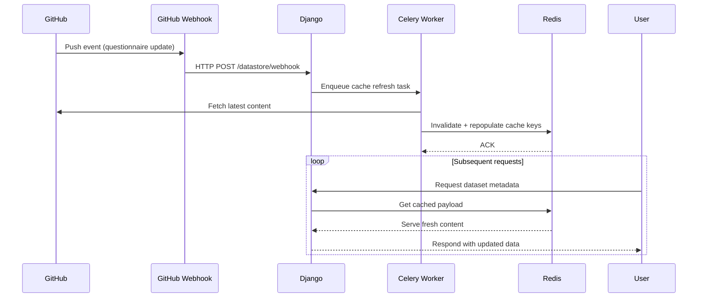
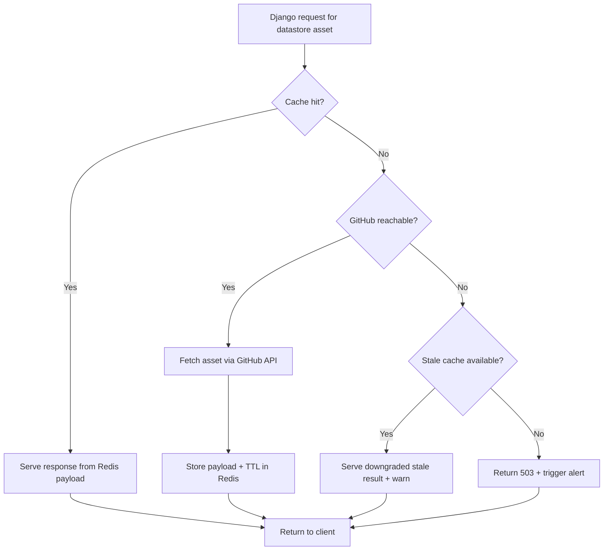
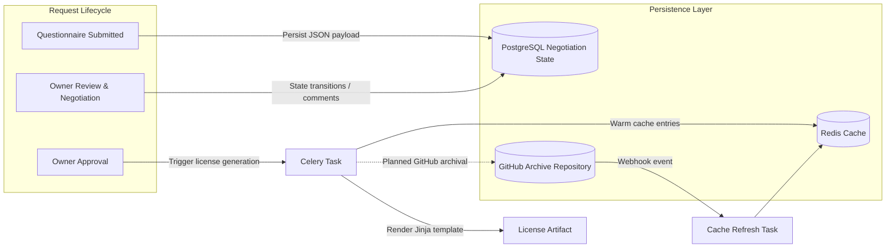
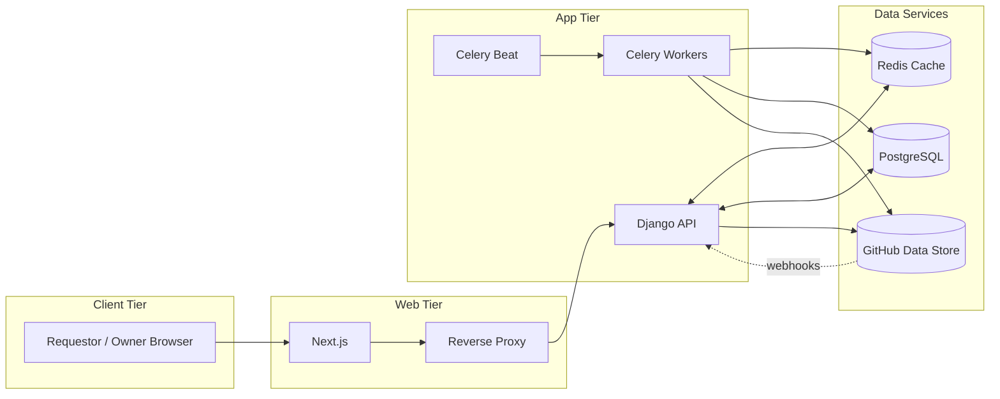

## Cache-Backed Data Flow

```mermaid
graph TD;

    User[User] --> |Submits Request| DRT_with_Django;

    DRT_with_Django --> |Reads/Writes Data| PostgreSQL;

    DRT_with_Django --> |Fetches Data from Cache| Cache;

    Cache --> |Regularly Updated from GitHub| GitHub;

    GitHub --Trigger--> Cache;

    Cache --> DRT_with_Django;

    DRT_with_Django --> |Fetches Static Assets (on cache miss)| GitHub;

    subgraph "DRT System"

        DRT_with_Django

        Cache

        PostgreSQL

    end

    subgraph "Data Store"

        GitHub

    end
```

---

## Diagram Walkthrough

- **User Interaction:** Users submit requests through the Django web service (e.g., completing questionnaires or negotiating licenses).
- **Cache-first Reads:** Django checks the cache for recently accessed or frequently used GitHub assets before reaching out to GitHub directly.
- **Cache Refresh:** GitHub is the source of truth for static content. Changes in GitHub trigger cache refreshes via webhooks or scheduled polling.
- **Dynamic State:** Negotiation data lives in PostgreSQL, and Django reads/writes relational state there throughout the workflow.
- **GitHub Reads:** When cached content is missing or stale, Django fetches the latest questionnaires and license templates directly from GitHub.
- **Future Work:** Automated upload of generated licenses to GitHub is planned but not yet implemented; current workflows deliver artifacts via email.
- **Fallback Logic:** If cached content is stale or missing, Django fetches fresh data from GitHub, updates the cache, and serves the latest version to the user.

---

## Full Workflow Summary

1. **Request Submission:** Requestors access DRT through UUID-backed links and submit data via dynamic questionnaires served by Django.
2. **Cache Coordination:** Django retrieves questionnaire metadata and related assets from the cache; cache misses fall back to GitHub and repopulate the cache.
3. **GitHub Synchronization:** GitHub changes trigger cache refreshes (via webhooks) or are detected by periodic polling jobs if webhooks are unavailable.
4. **Negotiation Management:** Negotiation states, conversations, and reminders reside in PostgreSQL, orchestrated by Django and auxiliary Celery tasks.
5. **Artifact Delivery:** Completed negotiations generate licenses that are emailed to requestors/owners; system-side archival to GitHub is a future enhancement.
6. **Ongoing Serving:** Subsequent requests benefit from cached data, reducing GitHub traffic while ensuring freshness when updates occur.

---

## Cache Refresh Sequence



### Notes

- Webhooks are preferred; scheduled Celery beat jobs can call the same task when webhooks are unavailable.
- Cache keys follow the dataset/questionnaire path convention to simplify targeted invalidations.

---

## Data Fetch Decision Tree



### Notes

- GitHub outages fall back to cached content when available; otherwise, the system fails fast and signals operators.
- Separate TTLs per asset class (questionnaires vs. license templates) balance freshness and rate limits.

---

## Negotiation Artifact Flow



### Notes

- Negotiation events remain in PostgreSQL; generated licenses are currently distributed via email. GitHub archival is an open roadmap item.
- Cache warmups following license generation ensure owners immediately see updated negotiation state, even without GitHub uploads.

---

## Operational Topology Overview



### Notes

- Redis serves both as a cache for GitHub content and as Celery’s broker/result backend in development.
- Production deployments may split Redis roles or swap in managed equivalents; update the diagram as infrastructure evolves.

---

## Related References

- GitHub data store example: <https://github.com/ClimateSmartAgCollab/DRT-DS-test>
- Cache warmup & synchronization commands: `backend/drt/management/commands/`

