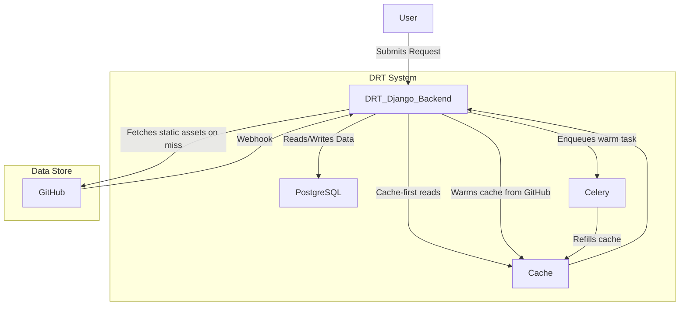
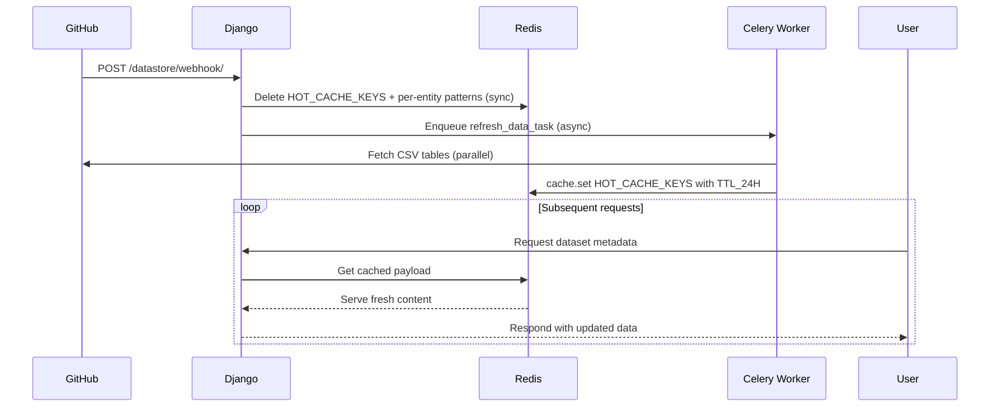
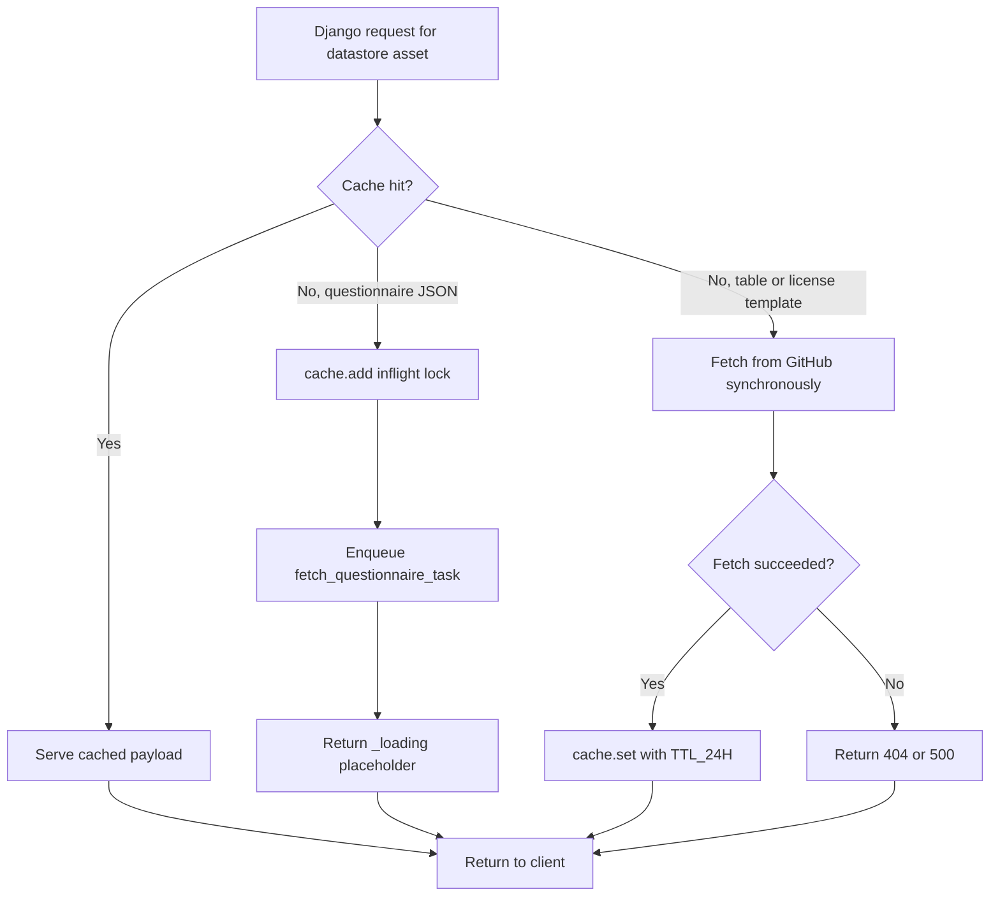
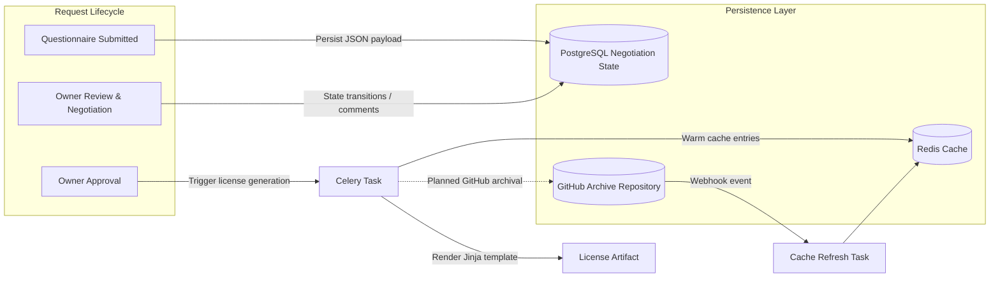
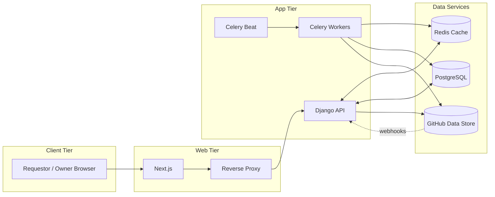

## Cache-Backed Data Flow

---

## Diagram Walkthrough

- **User Interaction:** Users submit requests through the Django web service (e.g., completing questionnaires or negotiating licenses).
- **Cache-first Reads:** Django checks the cache for recently accessed or frequently used GitHub assets before reaching out to GitHub directly.
- **Cache Refresh:** GitHub is the source of truth for static content. Changes in GitHub trigger cache refreshes via the webhook handler, and Celery Beat runs a scheduled pre-warm every 12 hours (`prewarm-github-cache`). There is no polling for change detection.
- **Dynamic State:** Negotiation data lives in PostgreSQL, and Django reads/writes relational state there throughout the workflow.
- **GitHub Reads:** When cached content is missing, Django fetches the questionnaire or license template directly from GitHub and stores the result in Redis for next time. For questionnaires, the fetch is offloaded to Celery and the view returns a `_loading` placeholder so the request never blocks on GitHub.
- **Future Work:** Automated upload of generated licenses to GitHub is planned but not yet implemented; current workflows deliver artifacts via email.
- **Failure Behavior:** There is **no stale-on-error fallback**. If a GitHub fetch fails on a cold key, the endpoint returns 404/500 (or keeps returning `_loading` until the inflight task succeeds). Operators should rely on webhook + Beat pre-warm, not stale-serve semantics.

---

## Full Workflow Summary

1. **Request Submission:** Requestors access DRT through UUID-backed links and submit data via dynamic questionnaires served by Django.
2. **Cache Coordination:** Django retrieves questionnaire metadata and related assets from the cache; cache misses fall back to GitHub and repopulate the cache.
3. **GitHub Synchronization:** GitHub changes trigger cache refreshes via the webhook handler. As a backstop, Celery Beat runs `refresh_data_task` every 12 hours to re-warm the cache regardless of webhook delivery.
4. **Negotiation Management:** Negotiation states, conversations, and reminders reside in PostgreSQL, orchestrated by Django and auxiliary Celery tasks.
5. **Artifact Delivery:** Completed negotiations generate licenses that are emailed to requestors/owners; system-side archival to GitHub is a future enhancement.
6. **Ongoing Serving:** Subsequent requests benefit from cached data, reducing GitHub traffic while ensuring freshness when updates occur.

---

## Cache Refresh Sequence

### Notes

- Invalidation is **synchronous** in Django; repopulation is **asynchronous** in Celery. There is a small window where both webhook-cleared keys and Beat-cleared keys can produce cache misses until the Celery worker finishes warming.
- Webhooks are preferred; the `prewarm-github-cache` Celery Beat job (every 12 hours) ensures the cache is refilled even if no webhook arrives.
- Cache keys and TTLs are defined in `backend/datastore/cache_keys.py`. Use the constants and helpers from that module rather than re-typing string literals.

---

## Data Fetch Decision Tree

### Notes

- All GitHub-backed assets share a uniform 24-hour TTL (`TTL_24H` in `cache_keys.py`). Freshness is driven by the webhook + Beat refresh path, not by TTL expiry.
- There is **no stale fallback**. A GitHub outage either keeps serving cache-warm content until the next invalidation, or surfaces 404/500 once keys are missing. Build a runbook around this rather than relying on graceful degradation.
- Questionnaire JSON uses the async `_loading` pattern (Celery + `cache.add` inflight lock); list endpoints read cache-only and never fetch GitHub inline.

---

## Negotiation Artifact Flow

### Notes

- Negotiation events remain in PostgreSQL; generated licenses are currently distributed via email. GitHub archival is an open roadmap item.
- License generation reads `owner_table` and `license_template_{id}` from Redis (and lazily fetches+caches the template on miss). It does **not** warm negotiation list state -- the negotiation list is driven by PostgreSQL plus React Query invalidation, not by Redis.

---

## Operational Topology Overview

### Notes

- In production, Redis backs both the Django cache (DB index `/1`) and the Celery broker/result backend (DB index `/0`) on the same instance. In local development, Celery is configured eager (`CELERY_TASK_ALWAYS_EAGER = True`) and uses an in-process `memory://` broker, while the Django cache still points at Redis.
- Production deployments may split Redis roles or swap in managed equivalents; update the diagram as infrastructure evolves.

---

## Cache Key Catalog

All datastore cache keys and TTLs are centralized in `backend/datastore/cache_keys.py`. Auth-related keys (magic tokens, login flags) live alongside the auth views and follow an `<scope>:<email>` naming scheme.

| Key | Type | TTL | Invalidated by |
|-----|------|-----|----------------|
| `owner_table` | dict | 24h | webhook, Beat |
| `link_table` | dict | 24h | webhook, Beat |
| `questionnaire_table` | dict | 24h | webhook, Beat |
| `license_table` | dict | 24h | webhook, Beat |
| `questionnaire_json_{id}` | dict | 24h | webhook |
| `license_template_{id}` | str | 24h | webhook |
| `questionnaire_fetch_inflight:{id}` | int | 30s | TTL or fetch completion |
| `magic_token:{token}` | dict | ~1h | TTL, logout |
| `owner_logged_in:{email}` | bool | 1h | TTL, logout |
| `req_logged_in:{email}` | bool | 1h | TTL, logout |
| `admin_magic_token:{token}` | dict | ~1h | TTL, logout |

## Cache Warm-Up Paths

There are four paths that populate the GitHub-backed cache; all call `warm_github_cache()`:

1. **App startup** -- `DatastoreConfig.ready()` spawns a daemon thread on every Django worker start.
2. **Manual / programmatic** -- `GET /datastore/load-data/` (used by admin tooling and a few frontend pages).
3. **Celery Beat** -- `prewarm-github-cache` runs every 12 hours.
4. **GitHub webhook** -- `POST /datastore/webhook/` deletes keys synchronously, then enqueues `refresh_data_task` (which calls `warm_github_cache()`).

`warm_github_cache()` short-circuits when all four `HOT_CACHE_KEYS` are present **and truthy** -- empty dicts from a previously failed warm do not count as "already warm."

## Async Questionnaire Loading

`fill_questionnaire` and `owner_review` never fetch questionnaire JSON inline:

1. On cache hit they return the cached payload.
2. On cache miss they call `cache.add(questionnaire_fetch_inflight:{id}, 1, timeout=30)` to elect a single fetcher per `questionnaire_SAID`, enqueue `fetch_questionnaire_task`, and return `{"_loading": true}`.
3. The Celery task fetches from GitHub, caches the JSON under `questionnaire_json_{id}` with `TTL_24H`, and **always** releases the inflight lock (including on failure, so retries are not blocked for 30 seconds).
4. The frontend polls every 2 seconds and gives up after ~30 seconds, showing a retry button rather than spinning indefinitely.

## Client-Side Cache (TanStack Query)

The frontend uses React Query as a second cache tier:

- **Negotiations lists:** `staleTime: 5m`, refetch on focus + on mount. Mutations call `invalidateQueries({ queryKey: ["negotiations"] })` to refresh after state changes. Background polling was removed -- negotiation state only changes on user actions.
- **`/datastore/load-data/`:** `staleTime: Infinity` on homepages (one warm call per session). Treat this as a safety net; the backend warm paths above are the real source of freshness.
- **`/datastore/cached-data/{key}/`:** dev/debug-only viewer, 5m stale, manual reload via mutation.

## Related References

- GitHub data store example: <https://github.com/ClimateSmartAgCollab/DRT-DS-test>
- Cache key registry & TTLs: `backend/datastore/cache_keys.py`
- Warm logic, webhook, debug endpoints: `backend/datastore/views.py`
- Startup warm thread: `backend/datastore/apps.py`
- Async fetch + refresh tasks: `backend/drt/tasks.py` (`fetch_questionnaire_task`, `refresh_data_task`)
- Celery Beat schedule: `backend/drt_core/settings/production.py`
- Cache layer tests: `backend/datastore/tests.py`

