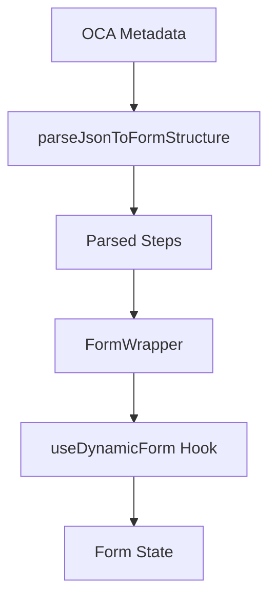
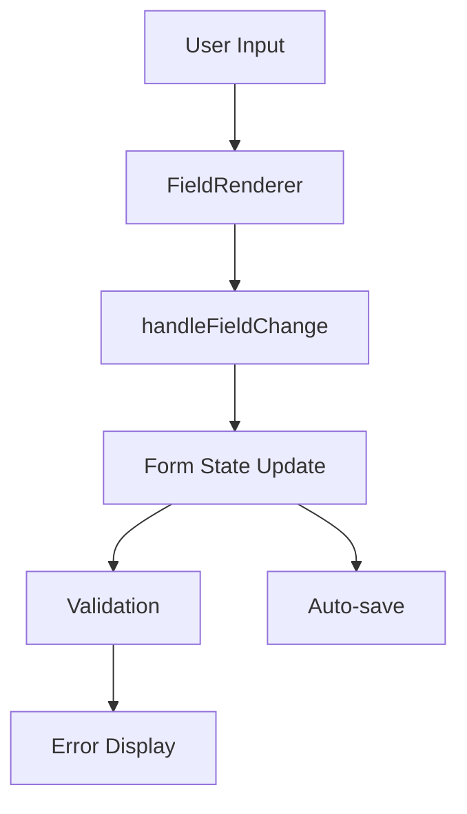
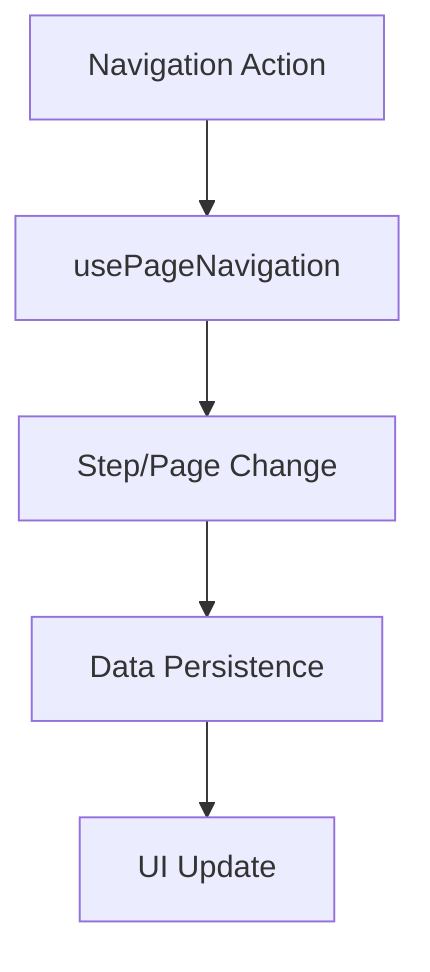

# DRT Form Component System

A dynamic form rendering system built with React, TypeScript, and React Hook Form. This system transforms OCA metadata into interactive, multi-step forms with advanced features including nested forms, validation, and real-time data management.

## Architecture Overview

The Form system is built around a modular architecture that separates concerns:

```
Form/
├── Form.tsx                    # Main entry point component
├── FormWrapper.tsx             # Core form logic and orchestration
├── FieldRenderer.tsx           # Dynamic field rendering engine
├── types.ts                    # TypeScript type definitions
├── utils.tsx                   # Utility functions
├── Form.module.css             # Component-specific styles
├── hooks/                      # Custom React hooks
│   ├── useDynamicForm/         # Form state management
│   │   ├── index.ts           # Hook exports
│   │   ├── useDynamicFormCore.ts # Core form logic and state management
│   │   ├── usePageNavigation.ts # Page navigation and step management
│   │   ├── useHandleNavigate.ts # Navigation event handlers
│   │   ├── validationSchema.ts # Yup validation schema generation
│   │   ├── validation.ts       # Form validation logic and rules
│   │   ├── mapping.ts          # OpenAIRE submission data mapping
│   │   └── utils.ts            # UTF-8 validation and step sorting utilities
│   └── useTheme.ts             # Theme management
├── context/                    # React Context providers
│   └── FormDataContext.tsx     # Form data state management
├── utils/                      # Additional utility functions
│   └── steps.ts                # Step-related utilities
├── FormHeader.tsx              # Form header component
├── NavigationButtons.tsx       # Navigation controls
├── NavigationItem.tsx          # Navigation item component
├── Sidebar.tsx                 # Form sidebar navigation
├── ReviewSection.tsx           # Form review component
├── ChildReview.tsx             # Nested form review
└── DateTimeField.tsx           # Date/time field component
```

## 🚀 Quick Start

### Basic Usage

```tsx
import Form from './components/Form/Form';
import { parseJsonToFormStructure } from './components/parser';

// Parse OCA metadata
const parsedSteps = parseJsonToFormStructure(questionnaireJson);

// Render the form
<Form
  parsedSteps={parsedSteps}
  questionnaireJson={questionnaireJson}
  initialAnswers={{}}
  onSave={(answers) => console.log('Saved:', answers)}
  onSubmit={(answers) => console.log('Submitted:', answers)}
/>
```

## 📋 Core Components

### FormWrapper.tsx
The main orchestrator component that handles:
- Form state management with React Hook Form
- Dynamic validation schema generation
- Multi-step navigation
- Nested form handling
- Data persistence and submission

**Key Features:**
- Automatic validation schema generation from OCA metadata
- Real-time form validation with Yup
- Multi-language support
- Nested form support for complex data structures
- Auto-save functionality
- Review and submission handling

### FieldRenderer.tsx
A dynamic field rendering engine that supports multiple field types:

**Supported Field Types:**
- `textarea`: Multi-line text input
- `text`: Single-line text input
- `select`/`dropdown`: Dropdown/select fields
- `reference`: Nested form references
- `DateTime`: Date/time picker fields
- `radio`: Radio button groups
- `checkbox`: Checkbox groups
- `enum`: Enumeration fields

**Features:**
- Automatic field type detection
- Dynamic validation rules
- Accessibility support
- Theme integration
- UTF-8 validation
- Error state handling

### FormDataContext.tsx
React Context provider for managing complex form state:

**Capabilities:**
- Parent-child form relationships
- Nested data structures
- Real-time data synchronization
- Form state persistence
- Child record management (create, edit, delete)

## 🔧 Custom Hooks

### useDynamicForm
The core form management hook providing:

```typescript
interface UseDynamicFormReturn {
  // Language management
  language: string;
  setLanguage: (lang: string) => void;
  
  // Navigation
  currentStep: number;
  visitedSteps: Set<string>;
  onNavigate: (index: number) => void;
  handleNextPage: () => void;
  handlePreviousPage: () => void;
  handleNavigate: (stepIndex: number) => void;
  
  // Data management
  formData: Record<string, Record<string, any>>;
  setFormData: React.Dispatch<React.SetStateAction<Record<string, Record<string, any>>>>;
  saveCurrentPageData: (updatedData?: Record<string, any>) => void;
  prefillCurrentPageData: () => void;
  
  // Parent-child form management
  parentSteps: ParsedStep[];
  isParentStep: (step: ParsedStep) => boolean;
  createNewChild: (parentFieldId: string, childStepId: string) => ChildRecord;
  editExistingChild: (parentFieldId: string, childId: string) => ChildRecord | null;
  deleteChild: (childId: string, parentFieldId: string, childStepId: string) => void;
  
  // Child state management
  currentChildId: string | null;
  setCurrentChildId: (id: string | null) => void;
  currentChildParentId: string | null;
  setCurrentChildParentId: (id: string | null) => void;
  isNewChild: boolean;
  setIsNewChild: (v: boolean) => void;
  
  // Page and step management
  pageIndexByStep: Record<string, number>;
  expandedStep: string | null;
  setExpandedStep: (s: string | null) => void;
  currentPage: ParsedPage | null;
  isLastPageOfThisStep: boolean;
  isFirstPageOfThisStep: boolean;
  isVeryLastPageOfLastStep: boolean;
  step: ParsedStep;
  
  // Validation and field handling
  fieldErrors: Record<string, string>;
  handleFieldChange: (field: ParsedField, newVal: any) => void;
  registerFieldRef: (id: string, el: HTMLInputElement | HTMLSelectElement | HTMLTextAreaElement | null) => void;
  
  // Review and submission
  reviewOutput: { title?: string; questions: any[] } | null;
  setReviewOutput: (v: { title?: string; questions: any[] } | null) => void;
  handleSubmit_openAIRE: () => void;
  handleVerifyAndSubmit: (format: "json" | "license" | "odrl") => void;
  
  // Form actions
  finishHandler: () => void;
  cancelHandler: () => void;
}
```

### useTheme
Theme management hook for consistent styling:

```typescript
const theme = useTheme();
// Returns: { colors, fonts, spacing, etc. }
```

## 🔄 Data Flow

### 1. Initialization


### 2. Form Interaction


### 3. Navigation


## 🧪 Validation System

### Dynamic Schema Generation
The system automatically generates Yup validation schemas from OCA metadata:

```typescript
// Generated from OCA metadata
const validationSchema = yup.object({
  "field-1": yup.string().required("This field is required"),
  "field-2": yup.number().min(0, "Must be positive"),
  "field-3": yup.array().min(1, "Select at least one option")
});
```

### Validation Features
- **Real-time validation**: Immediate feedback on field changes
- **Cross-field validation**: Complex validation rules between fields
- **Custom validators**: UTF-8 validation, format checking
- **Error display**: Contextual error messages
- **Accessibility**: Screen reader support for errors

## 🌐 Multi-language Support

The form system supports multiple languages through OCA metadata:

```typescript
// Language-specific labels
const labels = {
  eng: { "field-1": "Name" },
  fra: { "field-1": "Nom" }
};

// Dynamic language switching
const { language, setLanguage } = useDynamicForm();
```

## 🔗 Nested Forms

### Parent-Child Relationships
The system supports complex nested form structures:

```typescript
// Parent form with child references
{
  "parent-field": "refs:child-form-id",
  "children": [
    {
      "id": "child-1",
      "data": { "child-field": "value" }
    }
  ]
}
```

### Child Form Management
- **Create**: Add new child records
- **Edit**: Modify existing child records
- **Delete**: Remove child records
- **Review**: Preview child data in parent context

## 📊 Form Review System

### ReviewSection.tsx
Comprehensive form review before submission:

**Features:**
- Complete form data preview
- Child form review
- Data validation summary
- Submission format selection (JSON, License, ODRL)
- Export capabilities

### Review Output Formats
- **JSON**: Raw form data
- **License**: Structured license format
- **ODRL**: Open Digital Rights Language format

## 🔧 Configuration Options

### FormProps Interface
```typescript
interface FormProps {
  initialAnswers?: Record<string, Record<string, any>>;
  ownerComments?: Record<string, string>;
  globalOwnerComments?: string;
  onSave: (answers: Record<string, Record<string, any>>) => void;
  onSubmit: (answers: Record<string, Record<string, any>>) => void;
  parsedSteps?: ParsedStep[];
  questionnaireJson?: any;
}
```

### Advanced Configuration
- **Pre-filled data**: Initialize form with existing data
- **Owner comments**: Admin comments on specific fields
- **Global comments**: Form-wide comments
- **Save handlers**: Auto-save functionality
- **Submit handlers**: Form submission processing


## 📚 API Reference

### Core Functions

#### `parseJsonToFormStructure(metadata)`
Transforms OCA metadata into form structure.

#### `buildValidationSchema(steps)`
Generates Yup validation schema from form steps.

#### `sortStepsByReferences(steps)`
Sorts steps based on reference dependencies using Kahn's algorithm (cycle-aware).

### Utility Functions

#### `isValid__UTF8(text)`
Validates UTF-8 encoding of text input.

#### `formatSubheading(text)`
Formats subheading text with line breaks and bullet points for better readability.

